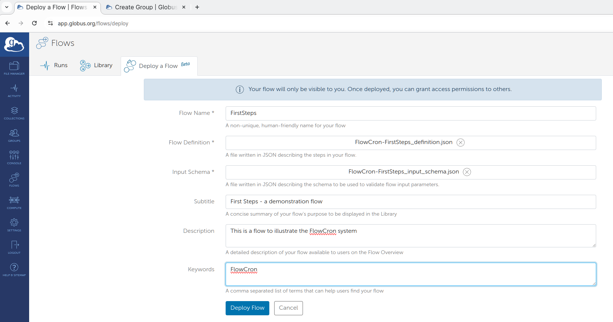

# FlowCron-Globus_Flow-side

[](https://doi.org/10.5281/zenodo.14246457)

## Before you start installing the Globus Flow side of FlowCron

Please install FlowCron on a HPC first. To install FlowCron on an HPC, it is **strongly advised that you are the PI or a manager of a project on the HPC** you want to install FlowCron. If you need to remind yourself of the settings for a previously installed FlowCron, see your ${HOME}/.config/flowcron directory on HPC.

There are two prerequisites for installing FlowCron:
1. The HPC allows the use of `cron` to the PIs and/or managers of projects on the HPC.
2. The HPC has a Globus collection allowing data to be transferred in and out to the project's designated directory location on the HPC.

To install the cron service portion of FlowCron in the HPC, clone this repository (https://github.com/baskerville-hpc/FlowCron-HPC-side) into a project directory on the HPC, and follow the instructions this repository's README.md file.

After you’ve performed that step you can return here to install the Globus Flow that will communicate with the cron service. This completes the FlowCron installation.

## Installation of the Globus Flow of FlowCron, primarily meant for HPC project PI/managers

### Running the bash script

To install the Globus Flow of FlowCron you need access to terminal with `bash` .

`bash` is available from a terminal on either a Linux or macOS machine or by using [Windows Subsystem for Linux](https://learn.microsoft.com/en-us/windows/wsl/install) terminal on a Windows PC/workstation.

First clone this repository and navigate inside it:

```
git clone https://github.com/rosalindfranklininstitute/FlowCron-Globus_Flow-side.git
cd FlowCron-Globus_Flow-side
```

Then execute:
```
bash construct_new_instance_FlowCron_configs.sh
```

Then the terminal will prompt you to enter some details (read the instructions and see the image below):


1. You'll get asked for a name for this instance of FlowCron, use the same name as you gave to the HPC side. This is not mandatory but helps tie things together (Question 1).
2. Then, enter the name of the HPC so all Globus Flow messages print it corrently (Question 2).
3. Then, enter the UUID of the HPC's Globus collection (aka the Globus collection used to transfer data in and out to the project's designated directory location on the HPC) (Question 3). 
   To find the UUID of the HPC's Globus collection:
   1. Click the Collections option in the left-hand menu bar.
   2. Type HPC's Globus collection name (be careful what options are enabled e.g. 'Administered By You`, 'In Use', etc. because these may prevent the collection being shown)
   3. Select the HPC's Globus collection.
   4. The output from this is shown below. The UUID of the HPC's Globus collection name is the last item displayed at the bottom.

4. Then, in `bash` script will ask for the absolute path to the FlowCron service on the HPC. This is the path to the directory where the HPC Side code was cloned on the HPC system, which should contain the `UploadedFiles` directory, the `CodeToRun` directory, etc. (Question 4). \
   To have this path printed, after you `ssh` to the HPC, navigate to this directory and use the case-sensitive `pwd -P` command. This command will give you the answer free from any symbolic links.
5. Lastly, set the interval of the time to check the job's status (Question 5). This value should be chosen considering the range of running times typical jobs submitted to FlowCron will take. If short jobs are typically submitted, then a short interval can help reduce the time taken in the case where the job has finished, but the Flow has yet to recognise this. If longer jobs are typically submitted, then a longer interval can help to keep the size of the Globus Flow logs to a minimum. This is due to the Flow checking the job’s status frequently before it’s completion, leading to the Flow logs containing numerous check status statements.

After answering all `bash` script questions, a new directory will be created locally with the name given to this instance of FlowCron, which was specified in Question 1.

In it there will be two new `.json` files. One with the `_definition.json` postfix and one with the `_input_schema.json` postfix.

### Create a Globus group to add the users you want to share FlowCron's Globus Flow with

Before you publish the FlowCron Globus Flow (aka make it available in the https://app.globus.org), first create a group to organise users who need to use this flow.

As the project PI and/or manager you should create a Globus group containing as 'Members' all the project members you would like to use FlowCron to automatically submit jobs/units of work.

To do this follow the guide mentioned [here](https://docs.globus.org/guides/tutorials/manage-identities/manage-groups/) 

In the rest of this document, we will refer to this group with the name `FlowCron_Globus_group`, but you can name it anything you like. 
As shown in the Overview tab of the group (last figure of the [guide](https://docs.globus.org/guides/tutorials/manage-identities/manage-groups/)), the **Group UUID** is being displayed. 
Please note down the **Group UUID** if you are planning to publish the Globus Flow using the Globus CLI, more about this below.

### Deploy FlowCron's Globus Flow using Globus UI

To deploy the FlowCron Globus Flow via the Globus UI follow step 3 from this [guide](https://docs.globus.org/guides/tutorials/flow-automation/create-a-flow/#create_the_flow)

First, login to https://app.globus.org 

On the left-hand side menu, select Flows and then click on the **Deploy a Flow** tab as shown in the image below:


Then click on the **Deploy Flow** button, as shown in the image below:


In the new window (see image below), input the Flow Name. 

The name should make it clear to which HPC and project the submitted jobs/units of work will be sent. 

Upload the two `.json` files appropriately.

You should upload the `FlowCron-<FLOWCRON_INSTANCE_NAME>_definition.json` in the Flow Defination field. \
And the `FlowCron-<FLOWCRON_INSTANCE_NAME>_input_schema.json` in the Input Schema field.

Fill in the other text fields if you require them.

Lastly, click **Deploy Flow** to deploy it.


Finally, you should publish the new Flow to the `FlowCron_Globus_group`, which was created in the [previous step](#create-a-globus-group-to-add-the-users-to-whom-you-will-share-flowcrons-globus-flow).

You can add this group to the flow, by going to Flows on the left-hand menu bar, and clicking on the **Library** tab.

To find the Globus Flow you just created more easily, you can select the **Administered by me** checkbox to reduce the number of displayed flows.

When you've found your Flow, click on the flow name, click the **Roles** tab, and finally the **Assign New Role** button.

This will open a new window as shown in the image below.

In this new window, select the **Group** option in the **Assign To** field. 

Then press the **Select a Group** button, and find and select the `FlowCron_Globus_group` group (or the name you gave your group in the [previous step](#create-a-globus-group-to-add-the-users-to-whom-you-will-share-flowcrons-globus-flow)).

Finally, select the **Runnable By** option in the **Role** field, so that all members of the group can run your Flow. 

Click the **Add Role** button to add the group with this role.


You may repeat the **Assign New Role** process mentioned above, if you want to allow to multiple groups or specific users to run the flow.

If you want you can repeat the process to add specific users/groups as administrators of the flow (i.e. The project PI if you are a manager of the project and/or other project managers.)

### Deploy FlowCron's Globus Flow using Globus CLI

An alternative way to deploy FlowCron's Globus Flow is via the Globus CLI.

The advantage of using Globus CLI is that you can deploy the flow and add roles in one step. The disadvantage is that you need to be more familiar with Python, and package managers like pip and conda, in addition to the Linux/macOS terminal.

Here are the [installation instructions]( https://docs.globus.org/cli/). To run Globus CLI you need a terminal with python-pip added in the PATH. You should do this in a virtual environment to prevent system damage.

The easiest way of installing Python is by using the [miniforge conda installer](https://github.com/conda-forge/miniforge) .

After the installation, you may create multiple conda environments (read more [here](https://conda.io/projects/conda/en/latest/user-guide/tasks/manage-environments.html)) but create one with python-pip specifically to install and run the Globus CLI python package.

If you install python-pip using miniforge and a new conda environment, please use the `pip` option, not the `pipx` option, from the Globus CLI installation instructions.

After you’ve finished installing the Globus CLI, run the [`globus login` command](https://docs.globus.org/cli/reference/login/).

After you successfully login, you can deploy FlowCron's Globus Flow, with the `globus flow create` command (read more [here](https://docs.globus.org/cli/reference/flows_create/)).

Below is an example command showing how to deploy FlowCron's Globus Flow and add the `FlowCron_Globus_group` group as a group that can run the flow in command. Replace the `<>` placeholder with the appropriate values.

```
globus flows create --input-schema FlowCron-<FLOWCRON_INSTANCE_NAME>_input_schema.json --starter urn:globus:groups:id:<FlowCron_Globus_group_UUID> '<FLOWCRON_INSTANCE_NAME>' FlowCron-<FLOWCRON_INSTANCE_NAME>_definition.json 
```

## How to use the FlowCron Globus Flow as a user

### Prepare your Job / Unit of Work

In FlowCron, you need to select a whole directory (called Unit of Work).

The Unit of Work should have the following directory/file structure:

```

Job_Dir
   ├── data
   │    └── <data-files-or-directories>
   └── scripts
        └── submission_script.sh
```
* There should always be 2 directories named `data` and `scripts` (even if they are empty directories).
* There can be other sub-directories apart from the `data` and `scripts` ones.
* There should **not** be any sub-directory named `sentinels`.
* Within the `scripts` sub-directory, there should be a **one** slurm script, which will be run by slurm.

The idea behind FlowCron is that there is one FlowCron per project on a HPC system. 
Therefore, the  slurm script, should be written similar to how the project slurm scripts are written for that HPC. So slurm arguments like `--qos`, `--account` or `--partition` will need the appropriate values for that project.  

Other slurm arguments should be filled in depending on the project and/or the job to be computed. 

Below is a template `submission_script.sh` that should be used:

```bash
#!/bin/bash
#SBATCH --qos=<qos>
#SBATCH --account=<account>
#SBATCH --time=d-hh:mm:ss
#SBATCH --ntasks=<ntasks>
#SBATCH --cpus-per-task=<cpus-per-task>
#SBATCH --gpus-per-task=<gpus-per-task>

# Module load section
module purge
module load <module-1>
...
module load <module-n>

# NO EDIT ZONE: START
working_directory=$1
echo "${SLURM_JOB_ID}: Working directory is ${working_directory}"

if ! [ -d $working_directory ]; then
  echo "${SLURM_JOB_ID}: ${working_directory} has not been found"
  exit 1
fi

#Stops on any errors
set -e

cd "${working_directory}"
# NO EDIT ZONE: END

# List of commands for the job
```
In the beginning of the `submission_script.sh` slurm script, sbatch options are being added (e.g. `--qos`, `--time`, etc.) , please fill them appropriately.

Please avoid using the `--output` or `-o` and the `--error` or `-e` options because these will be used by FlowCron and overwritten.

Add here any `module` commands to the `Module load section` so all the necessary dependencies for the job are loaded.

Between the `# NO EDIT ZONE: START` and `# NO EDIT ZONE: END` comments, there is a section with commands you should **NOT** alter. These commands help with logging details in the slurm `.out` file in case there are issues with the job which need to be debugged.

Finally, after the `NO EDIT ZONE` all of your job commands can be added, see the `List of commands for the job` section.

Also, **do not use any `$HOME` and/or `$USER` variables**, as the script will be submitted using the account of the person that installed FlowCron, which will typically be either the HPC project PI or a HPC project manager.

The slurm script will be submitted with a `sbatch` command and with the present working directory being the `Job_Dir`. \
For instance, the `sbatch` command looks like this `sbatch scripts/submission_script.sh`.

Since the present working directory is the `Job_Dir` directory, if you want for instance to point to a file e.g. `test.txt` in a directory named `test` which is the `data` directory, point to using the relative path `data/test/test.txt` in the script.

The general rule about file/folder paths used in the slurm script is that:
* For files/folders (data, models, etc), that are to be used as **input** to the script commands:
  * If they are **packaged with the job directory** (e.g. within the `data` directory) refer to them using **relative paths**.
  * If they are **stored already somewhere in the HPC** (e.g. in your personal directory) use **absolute paths**.
* For files/folders (data, models, etc), that are to be used as **output** to the script commands use **relative paths**.

### Submit a Job / Unit of Work to FlowCron's Globus Flow

**Important: If you haven't submitted via FlowCron for some time, or if it is your first time, please do the following:** \
Login to Globus (https://app.globus.org) and in the left-hand menu bar, then select **File Manager**, and then access the HPC's Globus collection. This may ask you to log in again. 
Some HPCs use OIDC Globus Collections that require re-authentication every X number of days. By pre-emptively accessing the HPC's Globus collection, it allows FlowCron's Globus Flow to also access it without the need to authenticate. 

After you create a job directory, to submit it, login to [Globus](https://app.globus.org), and in the left-hand menu bar, select **Flows**, and then go to the **Library** tab. \
To filter out most of Globus Flows in order to find FlowCron's Globus Flow more easily, you can select the:

* **Administered by me** checkbox if you are one of **flow's administrators**.
* **Runnable by me** checkbox if you are a **simple user**.

Type the specific name of flow if there are still many flows displayed. \
As mentioned, the name of the flow (chosen by the flow administrator that created the flow) should be clear. \
Meaning that it is clear to which HPC and project the submitted jobs/units of work will be sent.

Select the appropriate FlowCron Globus Flow, (in the image below shows one named `FirstSteps`).

Click **Start**.


**Important:** When you use FlowCron's Globus Flow for the first time you have to tick **Allow** in the Globus prompt to start using it (see image below).


The first thing displayed is the **Guided** tab (see image below). 

In this view, select the Globus collection from which you can upload the Unit of Work you want to submit. You can either use the UUID of the Globus Collection, or start typing its name. 

Next, type in the path to the Unit of Work directory, which in our example is the path to the `Job_Dir` directory.

This path has to end with a `/` character to signify you upload a whole directory, which in our Unit of Work example above, is the `Job_Dir` directory.

You can select if you want to clean up uploaded files after processing, by default, this option is off. 

Label this run of the flow and click **Start run**.


**Important:** If you have not used FlowCron's Globus Flow for some time or if it is your first time, please do the following after you click **Start run**. Click the **Flows** option in the left-hand menu bar, then the **Runs** tab, and open the flow run you just submitted. Wait a bit to ensure that the flow is not halted because it requires additional authorization or consents. It it does there will be a prompt you can select in order to provide them. 

Typically, when FlowCron's Globus Flow is used for the first time it requires multiple authorizations or consents in order to be allowed to access both your source Globus collection and the HPC's Globus collection. Without these, it will fail. 

In case additional authorization or consents are needed (see image below), an email will also be sent to the email address associated with your Globus account containing a link. You can click on this link in order to supply the appropriate consents.


After you have submitted your run, it’s a good practice to click  the **Flows** option in the left-hand menu bar and then the **Runs** tab,  where you can see your Flow running. 

If you click on it and go to the **Event Log** tab, you can see which state the flow has reached (see image below).


**For expert users**, Every time you submit a new run, open the **Roles** tab of the Flow run, click the **Assign New Role**, and add as **Manager** the person who deployed FlowCron's Globus Flow (it is typically the HPC project PI and/or a manager of the HPC project) **and only this person**. 

**Do not assign a role to anyone else nor attempt to assign any role if you are not experienced with using the Globus UI.**

We have already communicated with the Globus support team for a future feature to be added. This feature will allow a Flow administrator to be set as the only Manager in all of the runs of their Flow, and to be able to disable the ability of people who can run their Flow from being capable of assigning or changing roles on Flow's runs.

After the Unit of Work finishes being computed on the HPC (either successfully or unsuccessfully), any files and folders generated within the Unit of Work directory (in our example the `Job_Dir`) will be transferred back (transfer with sync to not waste time re-transferring the original files back) to the same location (Globus collection/path) where the Unit of Work was uploaded from.

If the `Delete job directory in <HPC-name> after transferring the results back?` was set to `true`, then the Unit of Work on the HPC will be deleted.

If the Unit of Work finished successfully, and `Delete job directory` set to `false`, then the Unit of Work directory structure will continue being stored in the cron service directory location (the path provided in Question 4 in [here](#running-the-bash-script)), under the `AnalysedFiles` directory, under the name `<Unit_of_Work_directory_name>_<flow_run_UUID>`.

If the Unit of Work finished unsuccessfully, then its directory will continue being stored in the cron service directory location (the path provided in Question 4 in [here](#running-the-bash-script)), under the `FailedJobs` directory, and the Unit of Work directory will be named `<Unit_of_Work_directory_name>_<flow_run_UUID>`

For more information, you can also check the Flow runs logs in the **Event Log** tab.
